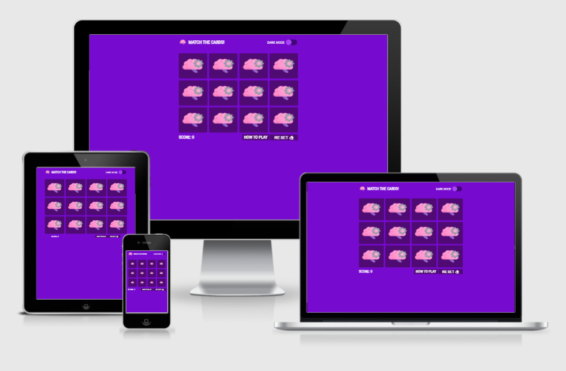

# MATCH THE CARDS!


## About
Match the cards is memory game to test your memory. Anyone can play this game on their smartphone, tablet or laptop. The aim of the game for the player is to find all matches and get a high score. The hardest challenge will be to find all matches in one go.

You can visit the website and play the game by [clicking here](https://adelliott92.github.io/Match-The-Cards/)

## Table of contents

[UX (User Experience)](#UX)  

[Features](#features)

[Technologies Used](#technologies)

[Testing](#testing)

[Deployment](#deployment)

[Known Bugs](#bugs)

[Credits](#credits)

<a name="UX"></a>
### UX (User Experience)

#### User Stories

As a first time visitor I want...
* The ability to play game on my mobile, tablet or laptop so I can play the game while on my daily commute or on the go.
* To find instructions easily by navigating through the site on how to play the game.
* To find out more about developer of the game.
* To find contact info to report issues to developer that I came across while playing the game.

<a name="features"></a>
### Features

The site has simple layout to make it easy for visitors to get straight into playing the game but if they are unsure how to play they can always visit the how to play page to read instructions on how to play the game.

#### Dark mode

Visitors can enable dark mode feature to give the site a darker theme and the goal of the feature was for visitors that want to play in dark or reduce the brightness from their screen.

#### Reset Button

If visitors are not happy with their score or the way game is going they can reset the game at any point by clicking on the reset button which completely resets the game.



#### Wireframes

- [Desktop wireframe](https://adelliott92.github.io/Match-The-Cards/assets/images/readme/desktop-wireframe.png)

- [Mobile wireframe](https://adelliott92.github.io/Match-The-Cards/assets/images/readme/mobile-wireframe.png)

#### Future features

In future releases we plan on releasing features that track the visitors score for progress tracking and a leaderboard to show how other visitors high scores.

<a name="technologies"></a>
### Technologies Used

#### Languages Used

- HTML5
- CSS3
- JavaScript

#### Frameworks, Libraries and Programs Used

- [jQuery](https://jquery.com/) - The JavaScript library jQuery was used to add interactivity to website and the game.
- [sweetalert2](https://sweetalert2.github.io/) - The JavaScript library was used for popup at the end of the game when visitor finishes the game.
- [Visual Studio Code](https://code.visualstudio.com/) - The developer used Visual Studio Code for their IDE to build the website.
- [Font Awesome v5.15.1](https://fontawesome.com/) - Font awesome was used to provide icons for the website.
- [Google Fonts](https://fonts.google.com/) - Google Fonts was was used to style text of the website.
- [Git](https://git-scm.com/) - Git was used in Visual Studio Code IDE for version control to commit and push to GitHub.
- [GitHub](https://github.com/) - GitHub was used to stored the website and website was deployed to GitHub pages to make website live.
- [Figma](https://www.figma.com/) - Figma was create to design the wireframes.

<a name="testing"></a>
### Testing

- [W3C Markup Validation Service](https://validator.w3.org/) - W3C Markup tool was to validate and ensure no syntax errors in HTML for website pages.
- [W3C CSS Validation Service](https://jigsaw.w3.org/css-validator/) - W3C CSS Validation tool was used to validate and ensure no syntax errors in the CSS stylesheet.
-[JSLint](https://www.jslint.com/) - JSLint tool was used to check for any issues with Javascript and jQuery code for the site.
- [WebAIM Constrast Checker](https://webaim.org/resources/contrastchecker/) - WebAIM Constrast Checker tool was used to ensure contrast between foreground and background colors meets accessibility guidelines.
- [WAVE Web Accessibility Evaluation Tool](https://wave.webaim.org/) - This tool was used to ensure that web content on the website was more accessible to individuals with disabilities and meet accessibility guidelines.
- [Can I Use...](https://caniuse.com/) - It was used to check what techologies were supported in different web browser versions.

#### Further Testing

- The website was tested in Google Chrome, Mozilla Firefox Developer, Opera, Microsoft Edge, Safari and Internet Explorer.
- The website was tested across a multipe device resolutions using Google Chrome developer tools and Mozilla Firefox developer tools.
- Family, Code Institute Mentor, Friends and work colleagues were asked to test and review the website to spot any issues from their devices and get their point of view of what they thought about the website.

<a name="deployment"></a>
### Deployment

This was project was developed in Visual Studio Code IDE and git was used within Visual Studio Code to commit and push to GitHub.

How to deploy this project to GitHub Pages from its GitHub repository following instructions below,

1. Log in to GitHub and locate the [Match The Cards GitHub Repository](https://github.com/adelliott92/Match-The-Cards/)
2. Near top of the Repository, locate the option "Settings" with cog icon on the menu.
3. Scroll down the Settings page until you locate the "GitHub Pages" Section.
4. Under "Source", click the dropdown called "None" and select "Master Branch".
5. The page will automatically refresh.
6. Scroll back down through the Settings page to locate the now published site in the "GitHub Pages" section. ***WARNNG: It may take a few minutes for website to come live.***

#### Forking the GitHub Repository

Forking the GitHub Repository will make a copy of the original repository on to your GitHub account to view and/or make changes without affecting the original repository by using the below instructions.

1. Log in to GitHub and locate the [Match The Cards GitHub Repository](https://github.com/adelliott92/Match-The-Cards/)
2. Near top of the Repository just above the "Settings" Button on the menu, locate the "Fork" Button.
3. You should now have a copy of the original repository in your GitHub account.

#### Making a Local Clone

1. Log in to GitHub and locate the [Match The Cards GitHub Repository](https://github.com/adelliott92/Match-The-Cards/)
2. Under the repository name, click "Clone or download".
3. To clone the repository using HTTPS, under "Clone with HTTPS", copy the link.
4. Open Git Bash
5. Change the current working directory to the location where you want the cloned directory to be made.
6. Type `git clone`, and then paste the URL you copied in Step 3.

```
$ git clone https://github.com/YOUR-USERNAME/Match-The-Cards.git
```

7. Press Enter. Your local clone will be created.

```
$ git clone https://github.com/adelliott92/Match-The-Cards.git
Cloning into 'Match-The-Cards'...
remote: Enumerating objects: 115, done.
remote: Counting objects: 100% (115/115), done.
remote: Compressing objects: 100% (67/67), done.
remote: Total 115 (delta 28), reused 107 (delta 23), pack-reused 0
Receiving objects: 100% (115/115), 222.95 KiB | 731.00 KiB/s, done.
Resolving deltas: 100% (28/28), done.
```

Click [Here](https://help.github.com/en/github/creating-cloning-and-archiving-repositories/cloning-a-repository#cloning-a-repository-to-github-desktop) to retrieve pictures for some of the buttons and more detailed explanations of the above process.

<a name="bugs"></a>
### Known Bugs

- The reset feature resets entire website and settings when should really only reset card grid.

<a name="credits"></a>
### Credits

#### Code

- [sweetalert2](https://sweetalert2.github.io/) - Sweetalerts2 was used to create a popup at the end of the game showing the users score and give them option to play the game again.

#### Media

All icons were sourced from following author on Flaticon.com

[Freepik](https://www.flaticon.com/authors/freepik)

#### Acknowledgements

- My mentor Excellence Ilesanmi has been really helpful for providing me with useful insights and advice on creating my website. 
- Code Institute Tutor Support and Students in Slack all have been really helpful with tips for completeting my second milestone project.
